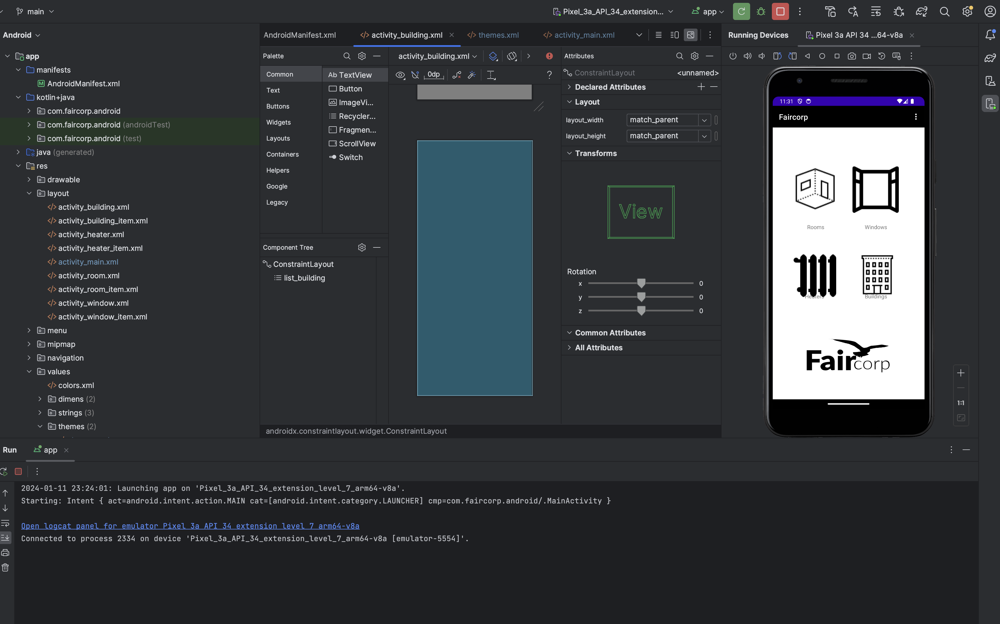

# TB3 Android App

**Developer:** Anjolaoluwa Adeuyi Joshua

## Overview
TB3 Android App is a comprehensive application designed to manage various aspects of buildings, including rooms, windows, heaters, and temperature sensors. This project aims to simulate and understand energy usage efficiency, particularly during winter seasons.

## Features
- **Building Management:** Control and monitor various building aspects.
- **Room and Window Indicators:** Keep track of room conditions and window statuses.
- **Heater Control:** Manage and adjust heater settings.
- **Temperature Monitoring:** Integrated temperature sensors for accurate readings.
- **Compatibility:** Tested on emulator and physical device (Pixel 6).
- **Cloud Support:** Implemented with clevercloud android support.

## Known Issue
- **Widget Placement:** Inconsistent widget placements in the main layout due to varying image behaviors.

## Additional Resources
- **Screenshots:** Two application screenshots are included in the repository.
- **Image Licensing:** All images used are license-free and safe to use.
